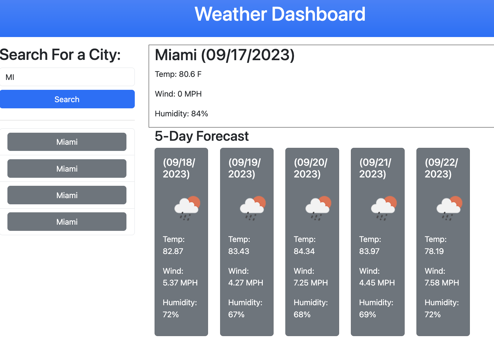

# 06 Server-Side APIs: Weather Dashboard
```

## How mine looks





### Challenges

    * Uses `localStorage` to store persistent data.

### Help Resources

TA's helped me catch an easy fix - a minor typo through off my entire code. 

Additionally, AskBCS helped immensely. 


